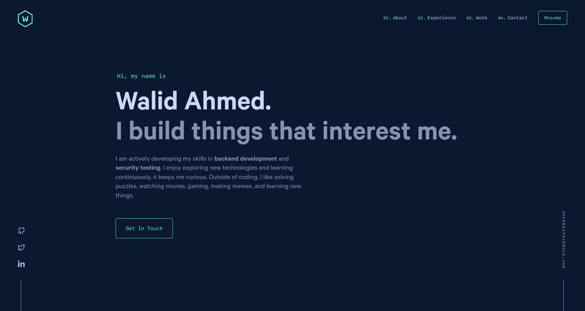

<div align="center">

</div>
<h1 align="center">
  SHREKBYTES.ME
</h1>
<p align="center">
  personal portfolio website...
</p>



## 🎨 Colors

```javascript
colors: {
  green: '#64ffda',
  navy: '#0a192f',
  darkNavy: '#020c1b',
}
```

## Installation & Set Up

1. Install the Gatsby CLI

   ```sh
   npm install -g gatsby-cli
   ```

2. Install and use the correct version of Node using NVM

   ```sh
   nvm install
   ```

3. Install dependencies

   ```sh
   yarn
   ```

4. Start the development server
   ```sh
   npm start
   ```

## Building and Running for Production

1. Generate a full static production build

   ```sh
   npm run build
   ```

2. Preview the site as it will appear once deployed
   ```sh
   npm run serve
   ```

## Deployment

1. **Netlify** (Recommended)

   - Connect your GitHub repository
   - Build command: `npm run build`
   - Publish directory: `public`

2. **Other platforms**
   - Run `npm run build`
   - Upload the `public` folder

## Acknowledgments

This site is based on the amazing work by [Brittany Chiang](https://brittanychiang.com). Check out her original [v4 repository](https://github.com/bchiang7/v4) for the source design and implementation.

## License

This project is licensed under the MIT License - see the [LICENSE](LICENSE) file for details.
